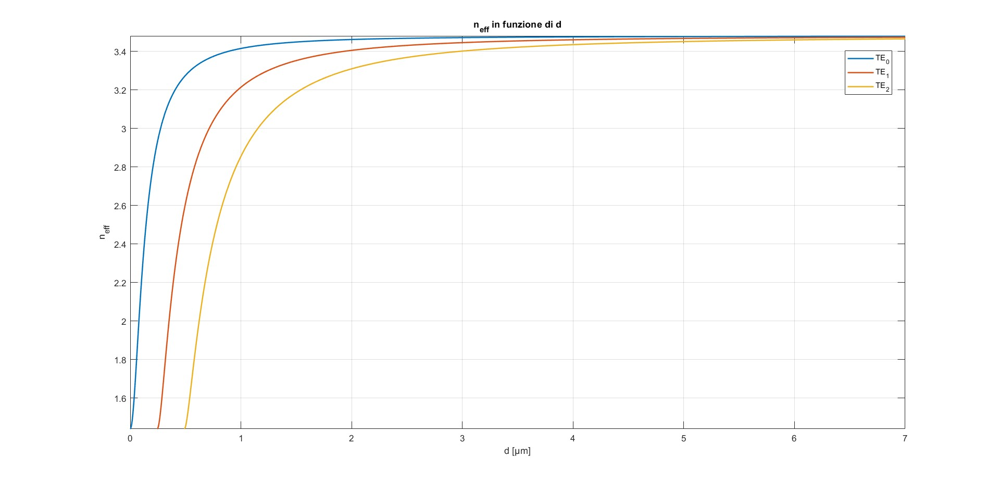
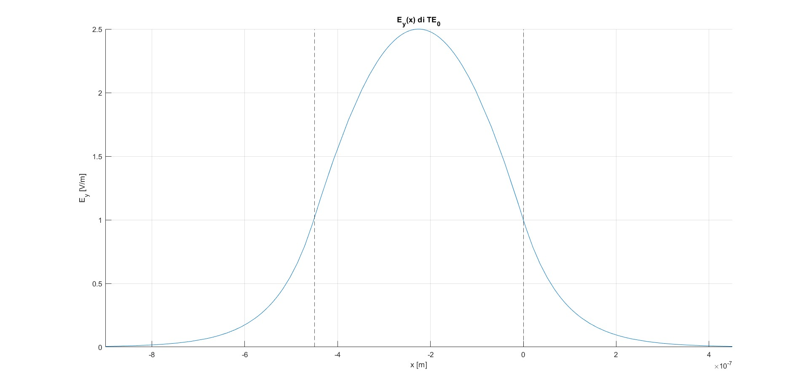
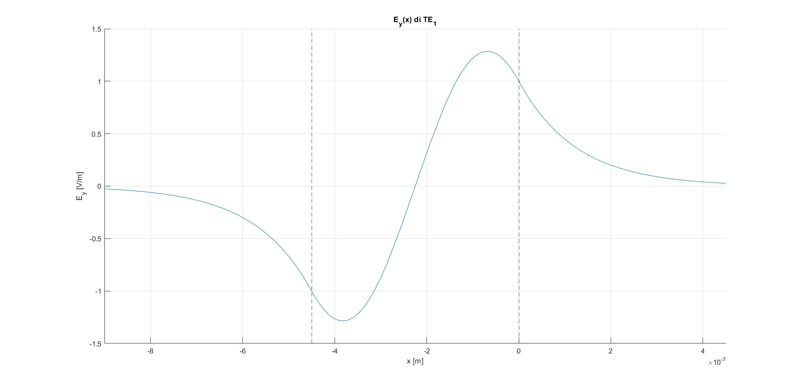
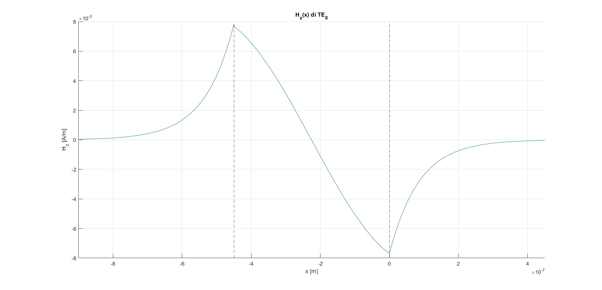
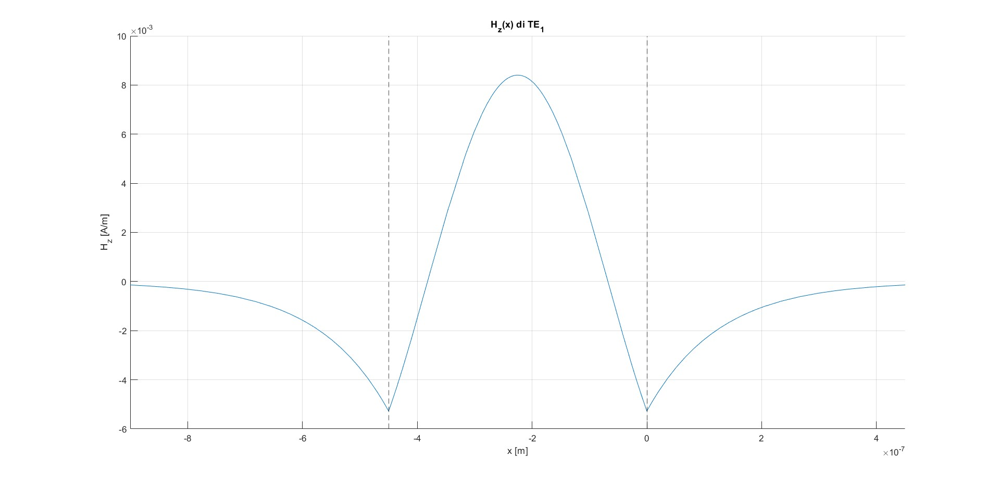
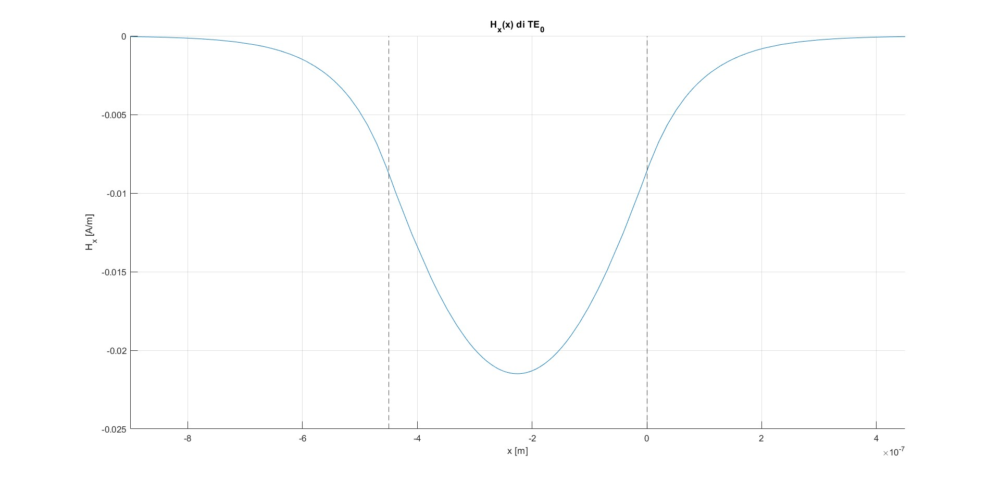
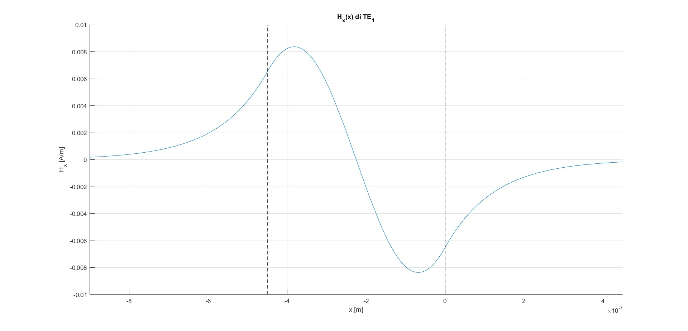
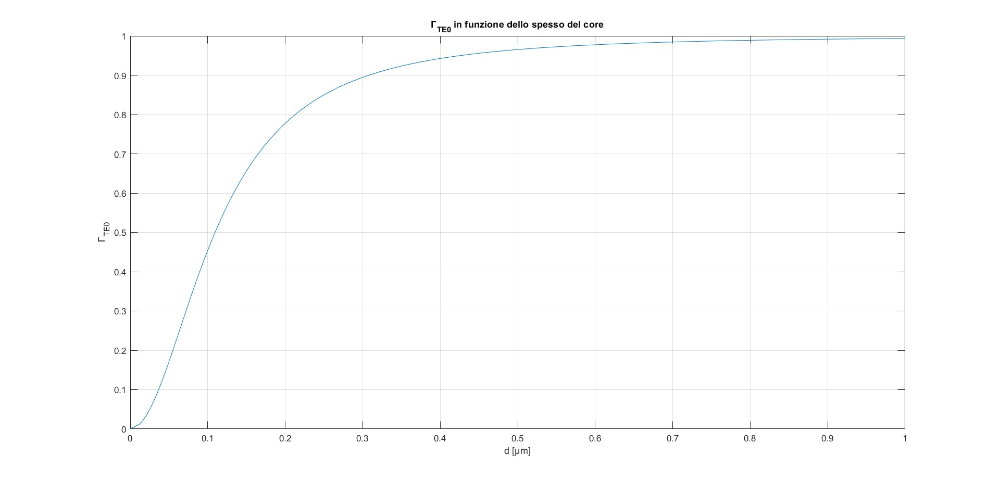
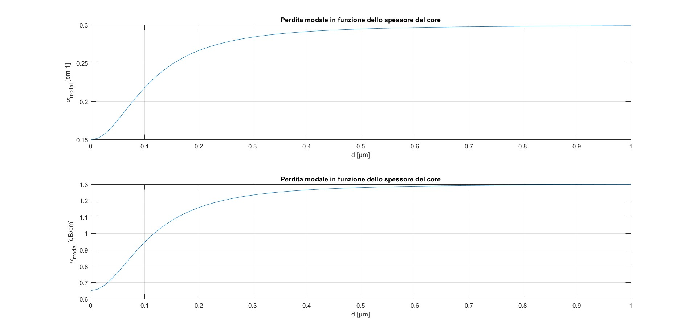
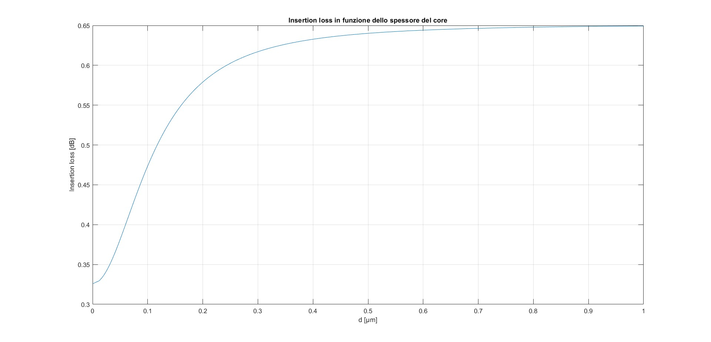

# TITOLO
## PROBLEMA 1

### Punto 1
Per una guida d'onda in silicio di tipo slab avente l'indice di rifrazione del core pari a $3.48$ e l'indice di rifrazione del cladding pari a $1.44$, è stato riportato sul grafico sottostante l'indice di rifrazione efficace $n_{eff}$ in funzione dello spessore $d$ del core per il modo fondamentale $TE$ a $1.55\,\mu m$. I risultati, ottenuti applicando la condizione di continuita del campo magnetico lungo l'asse z per la soluzione dell'equazione d'onda, mostrano i soli primi tre modi $TE$ della guida. I modi con indice superiore al secondo hanno un andamento molto simile a quelli visualizzati nel grafico, ovvero tenderebbero anch'essi a $n_{core}$ per lo spessore del core che tende ad infinito, ma avrebbero l'intersezione con l'asse delle ascisse a valori sempre maggiori di $d$. Osservando il grafico è possibile valutare quale sia lo spessore più opportuno per il core in base alle nostre specifiche di progetto. In particolare prenendo uno spessore minore di circa $0.25 \,\mu m$ la guida è monomodale, ovvero presenta solo il modo $TE_0$. Prendendo invece uno spessore compreso tra circa $0.25 \,\mu m$ e $0.5 \,\mu m$ la guida è multimodale, ovvero presenta anche il modo $TE_1$ oltre al modo $TE_0$. Tale ragionamento può essere esteso per tutti i modi $TE$ ma è importante notare come al crescere delle dimensioni dello spessore del core scelto, cresce anche il numero di modi che si propagano nella guida. Come suggerito dal nome stesso una guida monomodale supporta un solo modo di propagazione e ciò significa che all'interno della guida è possibile propagare una sola frequenza. Per una guida multimodale, invece, è possibile propagare più modi ovvero sono presenti più onde aventi frequenze diverse. 

$$
k_x = k_0\sqrt{n_{core}^2-n_{eff}^2}
$$
$$
\gamma=k_0\sqrt{n_{eff}^2-n_{core}^2}
$$
$$
d_{modo0}= \frac{2*\arctan{(\frac{\gamma}{k_x})}}{k_x}
$$
$$
d_{modo1}= \frac{2*\arctan{(\frac{\gamma}{k_x})}+\pi}{k_x}
$$
$$
d_{modo2}= \frac{2*\arctan{(\frac{\gamma}{k_x})}+2\pi}{k_x}
$$

### Punto 2
Per fare in modo che la guida d'onda in silicio specificata nel punto 1 abbiamo i soli modi $TE_0$ e $TE_1$, è necessario scegliere uno spessore del core compreso tra circa $0.25 \,\mu m$ e $0.5 \,\mu m$. Tutte le analisi seguenti sono condotte considerando uno slab avente lo spessore del core pari a $0.45 \,\mu m$. La scelta non è stata casuale in quanto l'intenzione era quella di avere una guida d'onda in cui il campo fosse il più confinato possibile dentro al core ($\Gamma$ più vicina possibile a $1$ come verrà descritto nel Punto 3) senza però avere anche il modo $TE_2$ nella guida.
Supponendo che la guida sia infinitivamente lunga in tutte le direzioni e supponendo che la discontinuità del materiale sia lungo l'asse x, dire che una guida sia $TE$ significa che essa ha il campo elettrico perpendicolare alla direzione di propagazione  dell'onda ($z$) e che ha componente del campo elettrico solo lungo l'asse $y$. Il campo magnetico, dovendo essere perpendicolare al campo elettrico, ha componente lungo l'asse $x$ e $z$. Nei grafici sottostanti sono state calcolate in maniera analitica le intensità dei campi $E_y$, $H_z$ e $H_x$ sia per il modo  $TE_0$ che per il modo $TE_1$ per mezzo delle equazioni di Maxwell (le linee verticali tratteggiate delimitano la porzione di core lungo l'asse $x$).
E' utile notare dai grafici che i campi hanno maggior intensità dentro al core della guida e che man mano che ci inoltriamo nel cladding allontanandoci dal core, l'intensità dei campi tende progressivamente a zero.
$$
E_y = \begin{cases}
  e^{-\gamma x} & \text{se } x > 0 \\
  \cos{(k_x x)-\frac{\gamma}{k_x}*\sin{(k_x x)}} & \text{se } -d \leq x \leq 0 \\
  (\cos{(k_x d)-\frac{\gamma}{k_x}*\sin{(k_x d)}}*e^{\gamma(x+d)}) & \text{se } x < -d 
\end{cases}
$$
$$
H_z = \frac{\jmath*\frac{\partial E_y}{\partial x}}{ \omega \mu_0}
$$
$$
H_x = \frac{-\jmath \beta_{\nu} E_y}{\omega \mu_0}
$$

    
    

    
    

    
    

### Punto 3
Nel grafico sottostante è mostrato l'andamento del fattore di confinamento $\Gamma$ al variare dello spessore del core della guida. Esso è definito come il rapporto tra potenza dentro al core e la potenza in tutta la sezione della guida come mostrano dalla formula qui di seguito.
$$
\Gamma_{TE} = \frac{P_{core}} {P_{total}} = \frac{\int_{-d}^{0} |\epsilon_y(x)|^2 \,dx} {\int_{-\infin}^{\infin} |\epsilon_y(x)|^2 \,dx}
$$

### Punto 4
Assumiamo ora che la guida d'onda in silicio aventi le proprità descritte nel $Punto 1$ abbia il coefficiente di attenuazione del core pari a $\alpha_{Si}=0.3\,cm^-1$ e il coefficiente di attenuazione del cladding pari a $\alpha_{SiO2}=0.15\,cm^-1$. E' possibile dunque calcolare il fattore di attenuazione modale tramite la seguete formula:
$$
\alpha_{modal}=\alpha_{Si}\Gamma_{core} + \alpha_{SiO2}\Gamma_{cladding} \qquad\qquad dove \qquad \Gamma_{cladding}=1-\Gamma_{core}
$$
Nei grafici sottostanti viene mostrato il fattore di attenuazione modale sia in forma lineare sia in decibel:
$$
\alpha_{modal, dB} = \alpha_{modal}*10log_{10}(e)
$$

### Punto 5
Considerato ora una guida lunga $L=5\,mm$, sul grafico sottostante è stato riportato il valore della perdita di inserzione al variare dello spessore del core.
$$
Insertion \,\, loss= alpha_{modal, dB}*L \qquad\qquad con\,\,L\,\,espresso\,\,in\,\,cm
$$

 ### Punto 6

